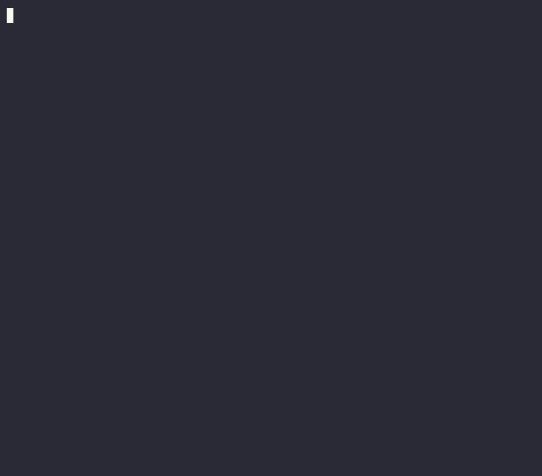

# demo/ — `@demlik/tea` terminal demos

Two recorded terminal casts of `@demlik/tea`'s runnable, deterministic demos:
**raft consensus** and **saga rollback**. Every byte on screen is real output
captured from the actual demo — see [How these are recorded](#how-these-are-recorded).

Each cast ships three ways to consume it:
- **GIF** — `<name>.gif`, embed-anywhere (READMEs, slides, Slack).
- **Live** — `asciinema play packages/tea/demo/<name>.cast` — crisp, selectable text, real pacing.
- **Rebuild** — `bash packages/tea/demo/record-<name>.sh` — re-captures real bytes and re-renders.

---

## 1. Consensus you can replay  ·  `raft`



A three-node Raft cluster (`n0, n1, n2`, majority 2 of 3) folds a fixed schedule
through five moves: **elect → commit → kill the leader → re-elect → converge**.
`n0` wins term 1 and commits `42`; the leader is partitioned away; a survivor
(`n1`) times out and wins a *higher* term 2; it commits `77` on the surviving
majority and the logs converge on `[42, 77]`. The whole run is a byte-identical
replay — same trace, same numbers, every time.

```sh
asciinema play packages/tea/demo/raft.cast      # ~62s · live
bash packages/tea/demo/record-raft.sh           # rebuild gif + cast
```

The underlying demo is `pnpm demo:raft` in `packages/raft-showcase` (with
`pnpm demo:raft:viz` there for the full 35-step ASCII timeline) — the raft
showcase is a private workspace package consuming `@demlik/tea`.

## 2. Saga rollback you can replay  ·  `saga`


The canonical Saga `order → charge → reserve → ship`, each committed step
declaring the compensation that undoes it, driven down **two scripted paths**.
The **happy path** commits all four and settles `completed`. The **forced
failure** path commits `order → charge → reserve`, then `ship` fails — and the
engine pivots into compensation, running the committed steps' undos in **strict
reverse order** (release inventory → refund → cancel order) before settling
`failed_compensated`. The dramatic beat is the ship failure and the reverse unwind.

```sh
asciinema play packages/tea/demo/saga.cast      # ~45s · live
bash packages/tea/demo/record-saga.sh           # rebuild gif + cast
```

The underlying demo is `pnpm demo:saga`.

---

## How these are recorded

[asciinema](https://asciinema.org) records a terminal session as a **`.cast`** —
a small JSON file of timestamped output. Unlike a GIF it's real, selectable text:
you can replay it (`asciinema play`), embed a player, or share a URL
(`asciinema upload packages/tea/demo/<name>.cast`). We render each `.cast` to a
GIF with [`agg`](https://github.com/asciinema/agg) for places that need an image.

```sh
brew install asciinema agg                       # one-time
asciinema play packages/tea/demo/raft.cast       # replay any cast in your terminal
agg --font-size 18 packages/tea/demo/raft.cast packages/tea/demo/raft.gif   # cast → gif
```

### Why we *synthesize* the cast instead of `asciinema rec`

`asciinema rec` records a live TTY. In a headless shell (CI, an agent session,
no controlling terminal) there's no TTY, and the headless recorder **doesn't
honor real `sleep` timing** — so a recorded GIF races by in a few seconds with
no readable pacing. Driving a live `rec` also means the pacing is whatever
happened that take.

So each cast is **built deterministically** from two files:

| File | Role |
|---|---|
| `make-<name>-cast.py` | The **script + direction**: the story, the voiceover, the typewriter effect, the colors, and frame-exact timing. Emits a v2 `.cast` on stdout. |
| `record-<name>.sh` | The **capture + render**: runs the *real* demo (`runDemo` + `narrateDemo`) to capture authentic bytes — every phase, leader, term, committed log, and trace step — then runs the generator and `agg`. One command, reproducible. |

The shared cast machinery (timing, palette, `write_cast`) lives in `castkit.py`.

The generator controls every pause to the millisecond, so the result is calm and
readable — but it **never invents output**: the phase headlines, node rows,
terms, commit indices, committed logs, and saga trace lines are all captured live
by `record-<name>.sh` from the actual demo (into `CAP/narrate.txt`, read via the
`CAP` env var). Change the engine, re-run the `record` script, and the cast
updates with the new real output.

### Authoring a new cast

1. Copy the closest `make-<name>-cast.py` and rewrite the story/direction section.
2. In `record-<name>.sh`, capture the real bytes you want to embed into a temp
   dir (the generator reads them via the `CAP` env var).
3. `bash packages/tea/demo/record-<name>.sh` → writes `<name>.cast` + `<name>.gif`.
4. Sanity-check pacing by replaying the timeline (below), or just `asciinema play` it.

### Verifying a cast (watch it without eyes)

A `.cast` is JSON, so you can replay it as a text timeline to check pacing and
catch glitches before rendering — exactly how these were proofed:

```sh
python3 - packages/tea/demo/raft.cast <<'PY'
import json, re, sys
ev = [json.loads(l) for l in open(sys.argv[1]).read().splitlines()[1:] if l.strip()]
ansi = re.compile(r'\x1b\[[0-9;?]*[A-Za-z]'); agg = {}
for tt, _, d in ev:
    c = ansi.sub('', d).replace('\r', '')
    if '\x1b' in d and not c.strip(): continue
    agg[round(tt, 1)] = agg.get(round(tt, 1), '') + c
for s in sorted(agg):
    line = ' '.join(x for x in agg[s].split('\n') if x.strip())
    if line.strip(): print(f"{s:6.1f}s | {line[:90]}")
PY
```
