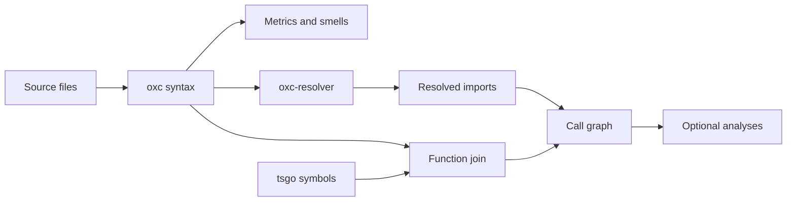

# How analysis works

[Documentation index](../README.md)

The tool starts with a source scan. Oxc parses TypeScript and extracts named
functions, imports, comments, and metrics. This is enough to find long
functions, deep nesting, and other structural problems without a type checker.

Call analysis adds two inputs: oxc-resolver follows module imports, and tsgo
resolves symbols. Function positions and kinds join the two syntax trees.
The resulting graph supports caller queries and the optional analyses.

The checker can load dependencies to understand types. Graph nodes still
come from the analyzed directory. Changing tsconfig selection with `--deep`
does not add files from other directories to the scan.

Classification rules add context: entries, auth checks, effects, and declared
worker bindings. A framework-called export needs an entry convention because
the framework's runtime call may not appear in the source graph. A path query
can only use the calls and roles the tool recognizes.

Uncertainty remains visible. Parse failures exclude files; unresolved binding
targets retain reasons; storage access can be `unknown`; unreachable candidates
can be withheld. Reports provide evidence for a decision, with the coverage
limits described in [the analysis reference](../reference/analyses.md).

## Repeatability

JSON keys and result arrays have stable ordering. Repeatable output requires
the same source, dependencies, config, paths, and analysis options.

Hotspots also depend on git history and the resolved time window. Door
declarations involving `process` depend on the Node version, platform, and
launch mode. Cluster traversal and tie-breaking are fixed rather than random.

## Verification

The package's self-check runs its own syntax analysis against its source.
The only self-check threshold override is `directorySprawl: 16`.
Parity tests compare saved CLI results on a fixture from the former engine.
An import check keeps native-preview behind one adapter and oxc inside the
engine directory; another check imports the built library subpaths.

These checks cover their fixtures and API boundaries. Performance measurements
and engine-comparison results are recorded separately in
[benchmark findings](../../bench/FINDINGS.md).

Source: [graph assembly](../../src/extract/assemble.ts),
[function join](../../src/checker/context.ts),
[self-check](../../src/selfcheck.test.ts),
[parity test](../../src/parity.test.ts),
[engine import check](../../src/engine/seam.test.ts).
